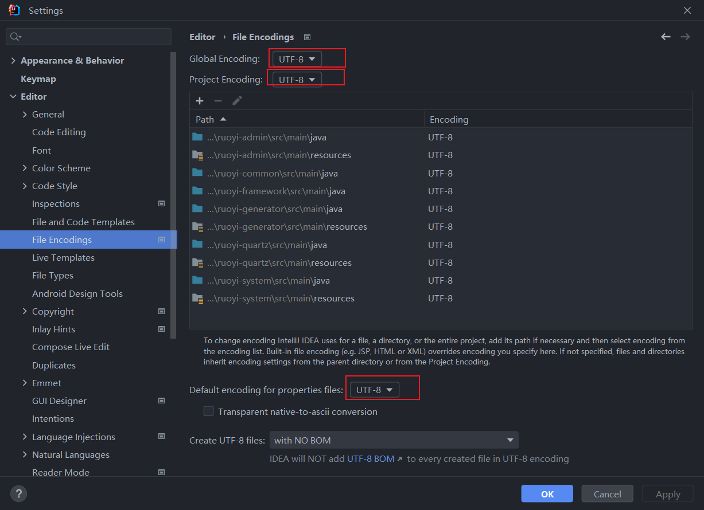

## 一、准备工作

环境：

win10、MySQL8、JDKjdk1.8.0_311

redis6.2.6

IDEA 2022.3.3

maven3.9

Node v18.14.2

npm 9.5.0


版本：

> 若依框架官方文档：http://doc.ruoyi.vip/
>
> 官网导航：http://120.79.202.7/
>
> 若依项目地址：[https://gitee.com/y_project/RuoYi-Vue](https://gitee.com/y_project/RuoYi-Vue)
>
> 若依管理系统介绍：[https://www.oschina.net/p/ruoyi](https://www.oschina.net/p/ruoyi)

了解项目目录结构：


## 二、搭建

1.拉取代码

```
git clone git@gitee.com:y_project/RuoYi-Vue.git
```

2.使用IDEA打开代码

3.刷新maven仓库


4.检测JDK版本、maven版本是否与本地保持一致


顺带解决中文乱码问题：



JDK版本：


maven版本：


5.在项目ruoyi-ui目录下，打开cmd终端或者在vscode中打开终端

安装依赖：

```
npm install
```

运行项目：

```
npm run dev
```

6.修改ruoyi-vue项目下ruoyi-admin模块下的mysql和redis配置

mysql需要修改自己创建的数据库名，执行sql脚本，还有用户名、密码，这些都是与你本地数据库对应上的。


redis的配置，首先你需要在本地（虚拟机）或者在云服务器上安装Redis


我是在云服务器上安装的，贴上配置docker启动配置：

```
docker run --name n_redis \
-p 6379:6379 \
-v /root/docker-data/redis/redis.conf:/etc/redis/redis.conf  \
-v /root/docker-data/redis/data:/data  \
-d redis --requirepass 131421 \
--appendonly yes 
```

>–name 给这个容器取一个名字
>
>-p 6379:6379 将6379端口挂载出去
>
>-v 数据卷挂载
>
>- - /root/docker-data/redis/redis.conf:/etc/redis/redis.conf  这里是将 liunx 路径下的redis.conf 和redis下的redis.conf 挂载在一起。
>  - /root/docker-data/redis/data:/data 这个同上
>
>-d redis 表示后台启动redis
>
>***–requirepass 000415 设置密码\*** （如果你是通过docker 容器内部连接的话，就随意，可设可不设。但是如果想向外开放的话，一定要设置，我被搞过，可以看这篇文章“阿里云服务器中毒‘Kirito666’经历”）
>
>**–appendonly yes 开启redis 持久化**

可以结合下面三篇安装redis，也可以自定义相关的配置：http://www.taodudu.cc/news/show-568948.html?action=onClick

https://blog.csdn.net/qq_42527269/article/details/130475009

https://blog.csdn.net/mimang_ma/article/details/131955495

再附上Redis连接工具来检测是否连接成功：

redis-cli 

https://redis.com.cn/clients.html

https://github.com/qishibo/AnotherRedisDesktopManager/releases/tag/v1.6.1

修改配置完成后就启动后台项目：


然后再启动前端项目ruoyi-ui

```
npm run dev
```

就此项目启动完成


## 遇到问题

前端启动报错：

```
  ⚡keney ❯❯ npm run dev

> ruoyi@3.8.6 dev
> vue-cli-service serve

 INFO  Starting development server...
10% building 2/5 modules 3 active ...\code\ideaProject\RuoYi-Vue-New\ruoyi-ui\src\main.jsError: error:0308010C:digital envelope routines::unsupported
    at new Hash (node:internal/crypto/hash:71:19)
    at Object.createHash (node:crypto:133:10)
    at module.exports (D:\code\ideaProject\RuoYi-Vue-New\ruoyi-ui\node_modules\webpack\lib\util\createHash.js:135:53)
    at NormalModule._initBuildHash (D:\code\ideaProject\RuoYi-Vue-New\ruoyi-ui\node_modules\webpack\lib\NormalModule.js:417:16)
```

若下图所示：


原因：

> [node版本](https://so.csdn.net/so/search?q=node版本&spm=1001.2101.3001.7020)高于16，项目的版本不高于16，node17之后更新了[OpenSSL](https://so.csdn.net/so/search?q=OpenSSL&spm=1001.2101.3001.7020)

解决方法：

方法1：

在package.json文件下 将"dev": " vue-cli-service serve"替换为"dev": "SET NODE_OPTIONS=--openssl-legacy-provider && vue-cli-service serve"

参考：https://www.cnblogs.com/dongfangzhaoyue/p/17487671.html

https://blog.csdn.net/zp357252539/article/details/122559236

方法2：

更换node版本，降低版本到12<=Node <=16，或者安装nvm来管理node版本